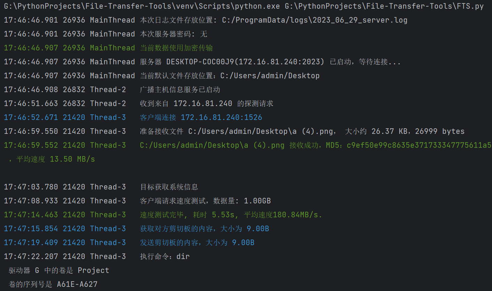

# 文件传输小工具

## 简介

`File Transfer Tools` 包含`FTS (File Transfer Server) `，`FTC (File Transfer Client) `两个组件，是**轻量**、**快速**、**安全**、**多功能**的跨设备文件传输脚本。

### 功能

1. 文件传输

- 可传输单个文件或者整个文件夹
- 安全性保障：可以使用加密传输（使用安全套接字层协议）、也可以明文传输
- 正确性保障：通过Hash值校验文件的一致性，判断文件夹内所有文件是否都正确传输
- 进度条显示：实时显示文件传输进度、当前网络速率、剩余传输时长
- 同名文件新命名传输、避免重复传输、覆盖传输三种方式

2. 命令行，可以便捷地在远端执行命令并实时返回结果，类似ssh
3. 自动寻找服务主机，也可手动指定连接主机
4. 文件夹比较，可显示两个文件夹中的文件的相同、差异等信息
5. 查看客户端与服务端系统状态、信息
6. 实时输出日志到控制台和文件中，并且可以自动整理压缩日志文件
7. 便捷测试客户端与服务器之间的网络带宽
8. 可以为服务器设置连接密码，增强安全性
9. 便捷同步客户端和服务器的剪切板内容

### 特点

1. 启动、运行、响应速度快
2. 采用最小默认配置原则，即开即用，也可以方便地自己修改配置
2. 可在局域网、公网等任意网络环境下使用，只要两台主机可以进行网络连接即可
3. 多线程传输，传输速度快，实测可以跑满1000Mbps带宽，由于设备限制，没有测试更高带宽
4. 运行时内存占用小，采用懒加载模式，确保对资源的最小占用
5. 即用即开，即关即走，关闭程序后不会残留进程
6. 目前适配Windows和Linux平台

### 如何选择

1. 如果你想要功能更强大的文件传输服务，请选择FTP服务器、客户端（如`FileZilla`、`WinSCP`等）
2. 如果你想要稳定的文件同步和共享，推荐使用`Resilio Sync`、`Syncthing`等
3. 如果你只是偶尔传输文件/不喜欢上述服务的后台存留、资源占用/不需要那么强大的服务/想要自己定制功能那请选择`File Transfer Tools`

## 安装与运行

`FTS`默认占用2023，2021端口，FTC默认占用2022端口。其中2023端口作为`FTS`的TCP侦听端口，2021、2022作为服务器和客户端之间UDP传输接口。
你可以在本文末尾查看详细配置信息并修改上述配置。

### 下载可执行程序

1. 点击右侧`Release`
2. 下载`File Transfer Tools.zip`
3. 解压文件夹，双击`FTC.exe` 或者 `FTS.exe` 即可运行
4. 或者在终端中运行程序以使用程序参数，例如`.\FTC.exe [-h] [-t thread] [-host host] [-p]`

### 使用Python解释器运行

1. 将源代码克隆到你的项目位置
2. 使用`pip install -r requirements.txt`安装所有依赖项
3. 使用你的python解释器执行脚本

#### 快捷执行方法

以Windows为例，你可以将FTS、FTC的运行命令分别编写为批处理文件，然后将批处理文件的目录添加到你的环境变量中，这样你就可以通过简单的在命令行中键入`FTS`、`FTC`
来使用默认的、最简单的命令来运行程序了。

例如，你可以将下面命令写入文件`FTS.bat`中

```powershell
@echo off
"The dir of your Python interpreter"\Scripts\python.exe "The dir of your project"\FTS.py %1 %2 %3 %4 %5 %6
```

将下面命令写入文件`FTC.bat`中

```powershell
@echo off
"The dir of your Python interpreter"\Scripts\python.exe "The dir of your project"\FTC.py %1 %2 %3 %4 %5 %6
```

然后，将批处理文件夹添加到你的环境变量中，最后在你的终端中键入以下命令就可以快捷运行代码了

```powershell
FTC.py [-h] [-t thread] [-host host] [-p password] [--plaintext]
或
FTS.py [-h] [-d base_dir] [-p password] [--plaintext] [--avoid]
```

以上批处理文件中，`%1~%9`表示程序传入的参数（`%0`表示当前路径）
注意，终端的默认工作路径为用户目录(~)，如需修改配置文件，请到该目录下修改。

## 用法

### FTC

FTC是客户端，用于发送文件和指令。

```
usage: FTC.py [-h] [-t thread] [-host host] [-p password] [--plaintext]

File Transfer Client, used to SEND files and instructions.

optional arguments:
  -h, --help            show this help message and exit
  -t thread             threads (default: 8)
  -host host            destination hostname or ip address
  -p password, --password password
                        Use a password to connect host.
  --plaintext           Use plaintext transfer (default: use ssl)
```

#### 参数说明

`-t`: 指定线程数，默认为逻辑处理器数量。

`-host`: 显式指定服务器主机名(可使用hostname或ip)及端口号(可选)，不使用此选项时，客户端自动寻找**同一子网**下的服务器

`-p`: 显式指定服务器的连接密码（默认情况下服务器没有密码）。

`--plaintext`: 显式指定明文传输数据，需要服务器也使用明文传输。

#### 命令说明

正常连接后，输入指令

1. 输入文件（夹）路径，则会发送文件（夹）
2. 输入`sysinfo`，则会显示双方的系统信息
3. 输入`speedtest n`，则会测试网速，其中n为本次测试的数据量，单位MB。注意，在**计算机网络**中，1 GB = 1000 MB = 1000000 KB.
4. 输入`compare local_dir dest_dir`来比较本机文件夹和服务器文件夹中文件的差别。
5. 输入`clip pull/push` 或 `clip get/send`来同步客户端和服务器的剪切板内容
6. 输入其他内容时作为指令让服务器执行，并且实时返回结果。

#### 运行截图

以下均为运行在同一台主机上的截图。

程序启动


传输文件


执行命令：sysinfo


执行命令：speedtest


执行命令：compare


执行命令：clip


执行命令行命令


### FTS

`FTS`是服务器端，用于接收并存储文件，执行客户端发来的指令。

```
usage: FTS.py [-h] [-d base_dir] [-p password] [--plaintext] [--avoid]

File Transfer Server, used to RECEIVE files and EXECUTE instructions.

optional arguments:
  -h, --help            show this help message and exit
  -d base_dir, --dest base_dir
                        File storage location (default: C:\Users\admin/Desktop)
  -p password, --password password
                        Set a password for the host.
  --plaintext           Use plaintext transfer (default: use ssl)
  --avoid               Do not continue the transfer when the file name is repeated.
```

#### 参数说明

`-d, --dest`: 显式指定文件接收位置，默认为配置项"平台_default_path"的值(Windows平台默认为**桌面**)。

`-p, --password`: 为服务器设置一个密码，防止恶意连接。

`--plaintext`: 显式指定数据明文传输，默认使用ssl加密传输。

`--avoid`：开启时，如果目录下已经有同名文件，分两种情况，若接收端的文件大小大于等于发送端则**阻止**该文件的传输，否则接收并**覆写**该文件；此功能主要用于一次传输大量文件被中断后的重传，类似断点重传，其他情况请**谨慎使用**。未开启时，如果存在的文件名为`a.txt`，则传输过来的文件会按照 `a (1).txt`、`a (2).txt`依次命名。

#### 运行截图



## 配置

配置项在配置文件`config.txt`中，当配置文件不存在时，程序会自动创建默认的配置文件

### Main 程序的主要配置
`windows_default_path`: Windows平台下默认的文件接收位置
`linux_default_path`: Linux平台下默认的文件接收位置
`cert_dir`: 证书文件的存放位置

### Log 日志相关配置
`windows_log_dir`: Windows平台下默认的日志文件存放位置
`linux_log_dir`: Linux平台下默认的日志文件存放位置
`log_file_archive_count`: 当日志文件数超过该大小时归档
`log_file_archive_size`: 当日志文件的总大小(字节)超过该大小时归档

### Port 配置端口相关内容
`server_port`：服务器 TCP 侦听端口
`server_signal_port`：服务器 UDP 侦听端口
`client_signal_port`：客户端 UDP 侦听端口